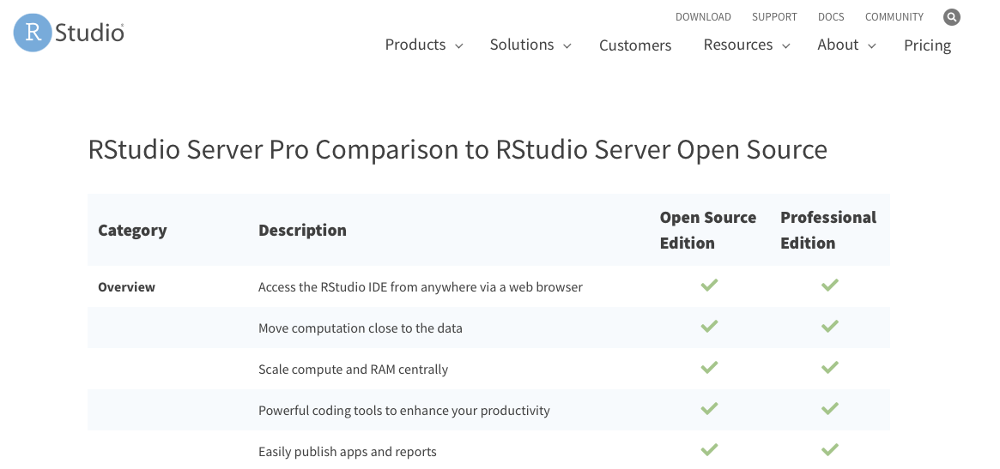

```{r setup, include=FALSE}
knitr::opts_chunk$set(echo = TRUE, eval= FALSE)
```

## Getting Started

```{r, echo = FALSE, eval = TRUE, preview = TRUE}

```


These are general instructions on how to setup and install RStudio Server and Shiny server on a Linux machine. For the purposes of this walkthrough, we will assume that the server is running Red Hat Enterprise Linux 8 and that we have sudo rights to run all commands.      

## Install Apache 
While Apache is not a required component to run RStudio, I suggest using Apache (or nginx) to proxy the site so that users do not need to type or remember a port to access the webpage. Using apache also allows us to easily implement SSL/TLS. For our instance, start with: 

```{bash}
sudo yum install httpd mod_ssl 
sudo systemctl start httpd 
sudo systemctl enable httpd
```


## Install R 
This walkthrough will have you install R by compiling it from source. You can install R via your package manager (yum or apt). We've chosen to install it via source, the main reason being stability and consistency. If you install via the package manager, when a newer version of R is released, it will update your version if you update the system.     

Because of this, I have seen instances where users would not update or patch their systems because they did not want to impact their version of R. By compiling from source, we allow users to properly keep their systems patched and updated without any worry about impacting their R version.    

Also, researchers sometimes build code and pipelines based on a certain version of R. A sudden change to that version could cause potential issues. If these are not issues in your scenario, than you can install via the package manager if you like. 

## Install R Prerequisite Packages 

These development packages help to ensure that R compiles with all of the capabilities R has available. 

```{bash}
sudo yum install bzip2-devel zlib-devel openssl-devel readline-devel libffi-devel libXext-devel libXt-devel xz-devel libcurl-devel libpng-devel libtiff-devel cairo-devel libjpeg-devel libicu-devel sqlite-devel libarchive-devel libXmu-devel blas-devel lapack-devel libxml2-devel
```

## Copy Script 

Using your preferred editor, e.g. vim, nano, etc., copy the contents of the following script to the server. For the purposes of this walkthrough, I'll call this script `R-install.sh`. You should also edit the prefix in the configure function line to match where you want R installed. Make sure you can actually to write to the directory you choose, or else the script will fail with `permission denied` errors.

```{bash}
#!/bin/bash 

VERSION=4.0.3 
mkdir /tmp/builddir 
cd /tmp/builddir 
wget https://cran.r-project.org/src/base/R-4/R-$VERSION.tar.gz 
tar xvf R-$VERSION.tar.gz 
cd R-$VERSION ./configure --prefix=/app/apps/rhel8/R/$VERSION --enable-R-shlib 
make 
make install 
rm -rf /tmp/builddir 
```


## Run script 
For this walkthrough, I saved the script to `/opt`.     
This process should take 10-15 minutes to complete. 

```{bash}
sh /opt/R-install.sh 
```


# Set R into the PATH 

Again edit the listed path to match where R was installed. 

```{bash}
cat <<eof>>/etc/profile.d/R.sh 
export PATH=/app/apps/rhel8/R/4.0.3/bin:\$PATH
EOF
```


## Install RStudio 

RStudio provides updated links to the latest install. Go to the RStudio download page, https://rstudio.com/products/rstudio/download-server/     
and select the appropriate OS for your installation. 

```{bash}
wget https://download2.rstudio.org/server/centos8/x86_64/rstudio-server-rhel-1.3.1093-x86_64.rpm 
sudo yum install rstudio-server-rhel-1.3.1093-x86_64.rpm
```


## Configure RStudio 

You need to edit the configuration file `/etc/rstudio/rserver.conf` to include the following line. 

As we did earlier, make sure this path is the same path where you installed R. 

```{bash}
rsession-which-r=/app/apps/rhel8/R/4.0.2/bin/R
```

## Edit Systemd Service File 
This is a tweak to fix an issue that could cause Rstudio to not startup properly. First copy the original systemd service file. 

```{bash}
sudo cp /usr/lib/systemd/system/rstudio-server.service /etc/systemd/system/rstudio-server.service
```

Then, using your preferred editor, add the following line after `'Type=forking'` 
 
```{bash}
StartLimitIntervalSec=0
```
 
Reload the systemd daemon and start the Rstudio Service as in the code chunk below.

```{bash}
sudo systemctl daemon-reload 
sudo systemctl start rstudio-server 
sudo systemctl enable rstudio-server
```

## Configure RStudio Vhost 
Copy the following code to a new configuration file for apache. For RHEL8, the configuration directory is `/etc/httpd/conf.d`     
You can call the file `rstudio-vhost.conf`.    
You will need to change the ServerName to the name you will be using for the webhost.     
You will need to change the information for the SSL Certificate as well. 

```{bash}
<VirtualHost _default_:80="">
  RewriteEngine On 
  RewriteCond %{HTTPS} !=on 
  RewriteRule ^/?(.*) https://%{SERVER_NAME}/$1 [R=301,L]
</VirtualHost> 

<VirtuaHost *:443="">
  ServerName rstudio.example.com 
  
  ErrorLog logs/ssl_error_log 
  # Does not work with IP v6 only IP v4
  SetEnvIf X-Forwarded-For "^.*\..*\..*\..*" forwarded 
  CustomLog logs/ssl_access_log combined env=!forwarded 
  CustomLog logs/ssl_access_log proxy env=forwarded 
  LogLevel warn 
  
  ProxyPass / http://localhost:8787/
  ProxyPassReverse / http://localhost:8787/
  
  SSLCertificateFile /etc/pki/tls/certs/rstudio.example.com.crt
  SSLCertificateKeyFile /etc/pki/tls/private/rstudio.example.com.key
</VirtualHost> 
```

Once the configuration is in place, you can restart Apache. 

```{bash}
sudo systemctl restart httpd
```

## Other Considerations 
###SELinux 
If you are running with SELinux in enforcing mode, you will need to set an SELinux boolean for Apache. 

```{bash}
sudo setsebool -P httpd_can_network_connect 1
```

## Install R Packages 

```{bash}
R 
install.packages(c('shiny','rmarkdown','devtools')) 
q()
```

## Install RShiny 
RShiny provides updated links to the latest install. Go to the RShiny download page, https://rstudio.com/products/rstudio/download-server/     
and select the appropriate OS for your installation. 

```{bash}
wget https://download3.rstudio.org/centos6.3/x86_64/shiny-server-1.5.15.953-x86_64.rpm 
sudo yum install --nogpgcheck shiny-server-1.5.15.953-x86_64.rpm
```

## Start and Enable the Shiny Server 

```{bash}
sudo systemctl start shiny-server 
sudo systemctl enable shiny-server 
```

## Configure RShiny Vhost
Copy the following code to a new configuration file for apache. For RHEL8, the configuration directory is `/etc/httpd/conf.d`. You can call the file `rshiny-vhost.conf`. You will need to change the ServerName to the name you will be using for the webhost. You will need to change the information for the SSL Certificate as well. 

```{bash}
<VirtualHost _default_:80="">
  RewriteEngine On 
  RewriteCond %{HTTPS} !=on 
  RewriteRule ^/?(.*) https://%{SERVER_NAME}/$1 [R=301,L]
</VirtualHost> 

<VirtualHost *:443="">
  ServerName rshiny.example.com 
  
  ErrorLog logs/ssl_error_log 
  # Does not work with IP v6 only IP v4
  SetEnvIf X-Forwarded-For "^.*\..*\..*\..*" forwarded 
  CustomLog logs/ssl_access_log combined env=!forwarded 
  CustomLog logs/ssl_access_log proxy env=forwarded 
  LogLevel warn 
  
  ProxyPass / http://localhost:3838/
  ProxyPassReverse / http://localhost:3838/
  
  SSLCertificateFile /etc/pki/tls/certs/rshiny.example.com.crt
  SSLCertificateKeyFile /etc/pki/tls/private/rshiny.example.com.key
</VirtualHost> 
```

Once the configuration is in place,     
you can restart Apache. 

```{bash}
sudo systemctl restart httpd
```
